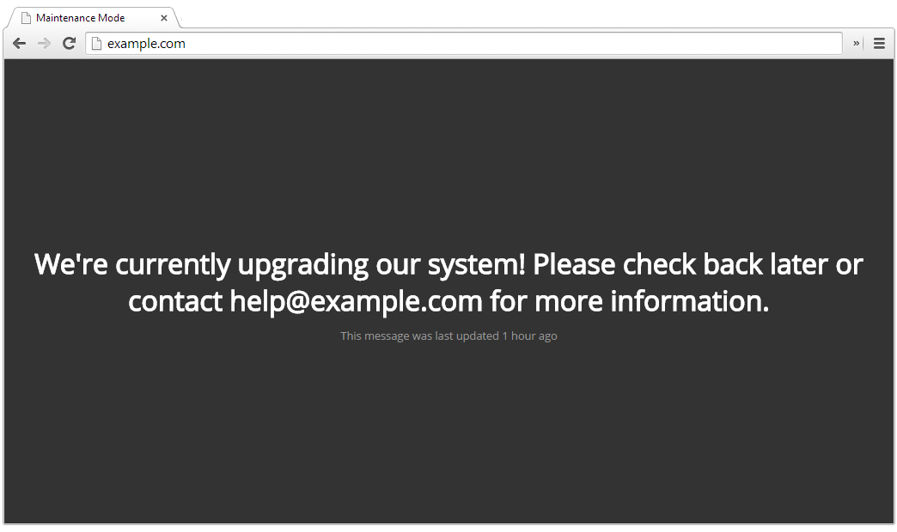
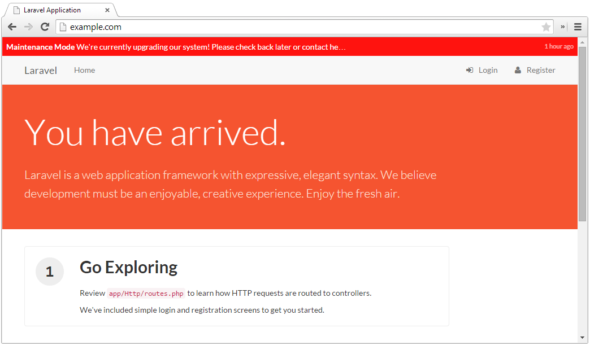

# Enhanced Laravel Maintenance Mode

This package is a drop-in replacement for Laravel's maintenance mode. The following versions are supported: 

* Laravel 5.0 - 5.2, please use the [1.0 branch](https://github.com/MisterPhilip/maintenance-mode/tree/1.0). 
* There are currently no plans to support Laravel 5.3 - 5.4. 
* Laravel 5.5 - 5.8, please use the [1.3 branch](https://github.com/MisterPhilip/maintenance-mode/tree/1.3)
* Laravel 6.0, please use the [2.0 branch](https://github.com/MisterPhilip/maintenance-mode/tree/2.0). Note that 5.5+ 
_can_ work with the 2.0 branch, but it is not guaranteed to be backwards compatible. 


Features include:
 - Allowing custom maintenance messages to be shown to users
 - Including a timestamp of when the application went down
 - Exempting select users via custom exemption classes
 - Firing an event for when the application goes down
 - Dynamically selecting the view to be shown on down command

## Table of Contents

  1. [Installation](#installation)
  1. [Changes from 1.0](#changes-from-1.0)
  1. [Usage](#usage)
  1. [Configuration](#configuration)
    1. [Default Configuration](#default-configuration)
    1. [Overriding Defaults](#overriding-defaults)
  1. [Exemptions](#exemptions)
    1. [Default Exemptions](#default-exemptions)
      1. [IP Whitelist](#ip-whitelist)
      1. [Environment Whitelist](#environment-whitelist)
    1. [Creating a New Exemption](#creating-a-new-exemption)
  1. [Views](#views)
    1. [Application Down](#application-down)
    1. [Maintenance Notification](#maintenance-notification)
  1. [Events](#events)

## Installation

Run the following command to install the latest:
```bash
$ composer require "misterphilip/maintenance-mode:~2.0"
```

Or, if you prefer installing it manually, within `composer.json` add the following line to the end of the `require` section:

```json
"misterphilip/maintenance-mode": "~2.0"
```

And then run the Composer install command:

```bash
$ composer install
```

Laravel _should_ automatically install the Service Providers, but verify they exist within the `config/app.php` file.
If they do not, add `MisterPhilip\MaintenanceMode\MaintenanceModeServiceProvider::class,` and
`MisterPhilip\MaintenanceMode\MaintenanceCommandServiceProvider::class,` to the end of the
`$providers` array in your `config/app.php`:

```php
'providers' => [

    /*
     * Application Service Providers...
     */
     App\Providers\AppServiceProvider::class,
     App\Providers\EventServiceProvider::class,
     App\Providers\RouteServiceProvider::class,

     ...

     MisterPhilip\MaintenanceMode\MaintenanceModeServiceProvider::class,
     MisterPhilip\MaintenanceMode\MaintenanceCommandServiceProvider::class,
],
```

Finally, in `app/Http/Kernel.php` replace the current MaintenanceMode Middleware

```php
\Illuminate\Foundation\Http\Middleware\CheckForMaintenanceMode::class,
```

with

```php
\MisterPhilip\MaintenanceMode\Http\Middleware\CheckForMaintenanceMode::class,
```


## Changes from 1.0

Since Laravel 5.3, messages are now allowed in the default `artisan down` command, as well as adding an option for the
`Retry-After` HTTP header. Because of this it should be noted that the syntax to call the `artisan down` command has
changed from the 1.0 branch to better match Laravel's default command.

Additionally, we've changed the
`MaintenanceModeEnabled` event to no longer use the `info` property, but instead have separate properties for each piece
of information. See more in the [events section](#events).

## Usage

This package overwrites the default `artisan down` command, with more options:

```bash
$ php artisan down [--message=MESSAGE] [--retry=RETRY] [--view=VIEW] [--allow*=ALLOW]
```

For example,

```bash
$ php artisan down --message="We're currently upgrading our system! Please check back later."
```

would show users a message of "We're doing some routine maintenance! Be back soon!". If you don't pass in a
message, the default "We're currently working on the site, please try again later" will
display to the users. Of course this default is configurable via a language string.

You can also change the view that is shown each time you run the `artisan down` command via the `--view=[VIEW]` option:

```bash
$ php artisan down --message="Be back in a few!" --view="errors/maintenance"
```

And of course you can use the default `--retry` option as well:

```bash
$ php artisan down --message="Be back in a few!" --view="errors/maintenance" --retry=60
```

To bring your application back online, run the normal app up command:

```bash
$ php artisan up
```

**NOTE:** by default, two [exemptions](#exemptions) enabled, which means that if you run
your development server locally (127.0.0.1) _or_ you have `APP_ENV=local` in your `.env` file, you will _not_ see the
maintenance page. You can remove these exemptions via the [configuration](#overriding-defaults).

## Configuration

This package is a drop-in replacement for the default maintenance mode provided with Laravel 5. This means
that you do not have to do any configuration out-of-the-box. However, if you'd like to tweak some of the
settings, there are a number of configuration values that are available to make this package a better fit
for your application.

### Default Configuration

Below are the default configuration options and a short description on each. Don't worry, all of this
information is within the configuration file too!

  - `view` (string)
    - The view to show to users when maintenance mode is currently enabled. This can be temporarily overridden when
    the command is called via the `--view` option
    - Defaults to `maintenancemode::app-down`
  - `notification-styles` (boolean)
    - Include CSS styling with the optional [maintenance notification](#maintenance-notification) view
    - Defaults to `true`
  - `inject.global` (boolean)
    - Enable or disable global visibility to maintenance mode variables (accessible in all views)
    - Defaults to `true`
  - `inject.prefix` (string)
    - Prefix the maintenance mode variables to prevent view variable name collisions
    - Defaults to `MaintenanceMode`
  - `language-path` (string)
    - The path to the maintenance mode language strings.
    - Defaults to `maintenancemode::defaults`
  - `exempt-ips` (string array)
    - An array of IP address that will always be exempt from the application down page
    - Defaults to `['127.0.0.1']`
  - `exempt-ips-proxy` (boolean)
    - Use [proxies](http://symfony.com/doc/current/components/http_foundation/trusting_proxies.html)
    to get the user's IP address
    - Defaults to `false`
  - `exempt-environments` (string array)
    - An array of environment names that will always be exempt from the application down page
    - Defaults to `['local']`
  - `exemptions` (string array)
    - A list of the exemption classes to execute. *See [Exemptions](#exemptions)*
    - Defaults to:
```php
    '\MisterPhilip\MaintenanceMode\Exemptions\IPWhitelist',
    '\MisterPhilip\MaintenanceMode\Exemptions\EnvironmentWhitelist',
```

### Overriding Defaults

If you need to override the default configuration values, run the following command:

```bash
$ php artisan vendor:publish --provider="MisterPhilip\MaintenanceMode\MaintenanceModeServiceProvider" --tag="config"
```

Now you can edit the values at `config/maintenancemode.php`.

## Exemptions

Exemptions allow for select users to continue to use the application like normal based on a specific
set of rules. Each of these rule sets are defined via a class which is then executed against.

### Default Exemptions

By default, an IP whitelist and an application environment whitelist are included with this package
to get you off the ground running. Additionally, more examples are provided for various types of
exemptions that might be useful to your application.

##### IP Whitelist

This exemption allows you to check the user's IP address against a whitelist. This is useful for
always including your office IP(s) so that your staff doesn't see the maintenance page. This is similar
to the `allow` option that is offered in Laravel 5.6+ (and is backported to 5.5 with this package), however
the `allow` option requires you to pass the IPs every time, vs. this method allows for you to have IPs stored
in the configuration. Both methods can be used with each other, e.g. a static internal network should always be
allowed via the config, while an additional IP for a vendor or remote employee can temporarily be added via the
`allow` option.

Configuration values included with this exemption are:

  - `exempt-ips` - An array of IP addresses that will not see the maintenance page
  - `exempt-ips-proxy` - Set to `true` if you have IP proxies setup

##### Environment Whitelist

This exemption allows you to check if the current environment matches against a whitelist. This is
useful for local development where you might not want to see the maintenance page.

Configuration values included with this exemption are:

  - `exempt-environments` - An array of environments that will not display the maintenance page

### Creating a new exemption

Setting up a new exemption is simple:

  1. Create a new class and extend `MisterPhilip\MaintenanceMode\Exemptions\MaintenanceModeExemption`.
  You might consider creating these files in `app\Exemptions` or `app\Infrastructure\Maintenance`, but
  you're free to place them where you want.
  2. This class must include an `isExempt` method. This method should return `true` if the user should
  not see the maintenance page. If this returns `false`, it indicates that the user does not match
  your ruleset and other exceptions should be checked.
  3. Add the full class name to the `exemptions` array in the configuration file.

Below is an template to use for a new exemption class `SampleExemption`:

```php
<?php namespace App\Exemptions;

use MisterPhilip\MaintenanceMode\Exemptions\MaintenanceModeExemption;

class SampleExemption extends MaintenanceModeExemption
{
    /**
     * Execute the exemption check
     *
     * @return bool
     */
    public function isExempt()
    {
        return true; // or false
    }
}
```

## Views

There are 2 views included with this package: an "application down" page that replaces the current "Be
right back!" page, and a "maintenance notification" which is a notification bar that tells exempted users
that the application is in maintenance mode.

You can also publish these views so that you can edit them easily. The command below will publish the views
to `resources/views/vendor/maintenancemode/*`. Once published be sure to change the config values (`view`)
to point to the new file location.

```bash
$ php artisan vendor:publish --provider="MisterPhilip\MaintenanceMode\MaintenanceModeServiceProvider" --tag="views"
```

### Application Down


*The default maintenance page, `maintenancemode::app-down`*

Included is a default view that displays your custom message and a timestamp for your users. To change this page,
update the `view` configuration value to point to the new view. The following variables are available for
you to use:

  - `$MaintenanceModeEnabled` - Check to see if the maintenance mode is enabled
  - `$MaintenanceModeMessage` - The message that should be displayed to users (either the one passed via
  the command call, or the default from the language file)
  - `$MaintenanceModeTimestamp` - The timestamp from when the application went into maintenance mode

**NOTE**: If you've changed the `inject.prefix` configuration value, you'll need to reflect this change in the
variable names above. For example, if `inject.prefix = "Foobar"`, your view variables would be `$FoobarEnabled`,
`$FoobarMessage`, and `$FoobarTimestamp`.

**NOTE**: By default, these variables are available in all views. To disable this functionality and have it
only inject variables on the maintenance page, change the `inject.global` configuration value to `false`.

You can also temporarily override the view shown by passing in the `--view` option when calling the `artisan down`
command. E.g. if you wanted to use the default `errors/503.blade.php` view, you could call:

```bash
$ php artisan down --view="error/503"
```

### Maintenance Notification


*The optional maintenance notification, `maintenancemode::notification`*

We've included a maintenance notification for users that want to include a notice to those that are exempt
from seeing the maintenance page. We've found that as an admin, it's helpful to know when your application
is in maintenance mode in the event that you've forgotten to disable it or it was turned on automatically.

You can enable this notification by placing the following code within your main blade layouts file(s):

```php
@include('maintenancemode::notification')
```

## Events

This package [fires an event](https://laravel.com/docs/master/events),
`MisterPhilip\MaintenanceMode\Events\MaintenanceModeEnabled`, whenever the application goes down for maintenance,
and `MisterPhilip\MaintenanceMode\Events\MaintenanceModeDisabled` when it is brought back up. You can add your own
listeners in your events Service Provider. By default this is located at `app/providers/EventServiceProvider.php`.
You can find several example listeners in the [events examples](examples/events), including logging when the
application went down or up, and updating [Statuspage](https://www.statuspage.io) via the
[checkitonus/php-statuspage-sdk](https://github.com/checkitonus/php-statuspage-sdk) package.

```php
protected $listen = [
    'MisterPhilip\MaintenanceMode\Events\MaintenanceModeEnabled' => [
        'App\Listeners\UpdateStatusPageMaintenanceStarted',
    ],
    'MisterPhilip\MaintenanceMode\Events\MaintenanceModeDisabled' => [
        'App\Listeners\UpdateStatusPageMaintenanceEnded',
    ],
    // ..
];
```

The original `message`, `time` the app went down, `retry` length, `view`, and `allowed` are all properties available on both events.
